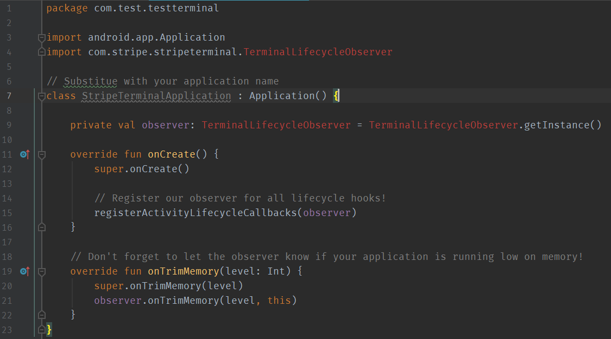

# Stripe Terminal Android Studio Bug

This project builds and runs, but Android Studio cannot find anything within the com.stripe.stripeterminal package. This problem is happening on Windows and macOS in Android Studio 3.5.1. I used previous versions of Stripe Terminal prior to 1.0.0. This problem happened after updating from a beta version of the Stripe Terminal library to the 1.0.0 release version.

Here is what I'm seeing on both of my computers:

I've tried:
- File > Invalidating Caches / Restart
- Deleting .idea and build/ directories and reimporting the project.
- gradlew cleanBuildCache
- Deleting %USER_HOME%\.gradle/caches/ (Windows) or $HOME/.gradle/caches/ (macOS)
- Build > Clean, Build > Rebuild
- Several combinations of the above.
